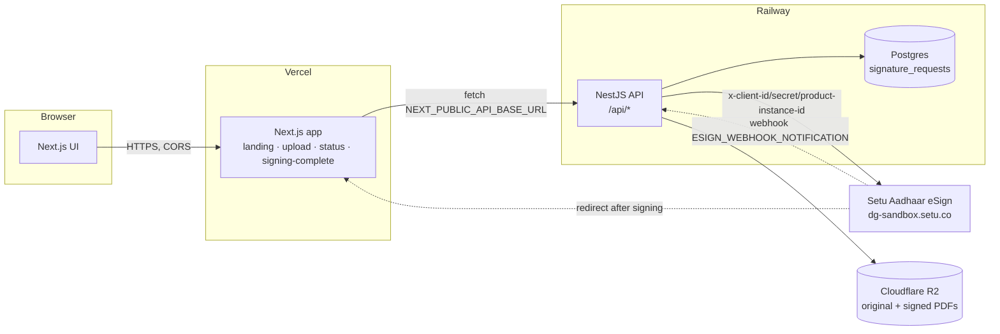
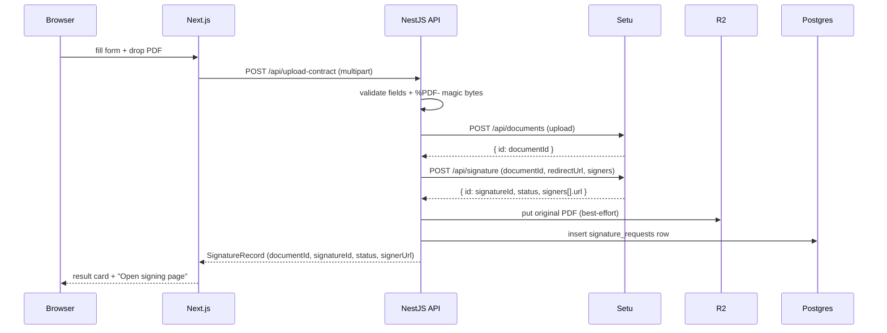
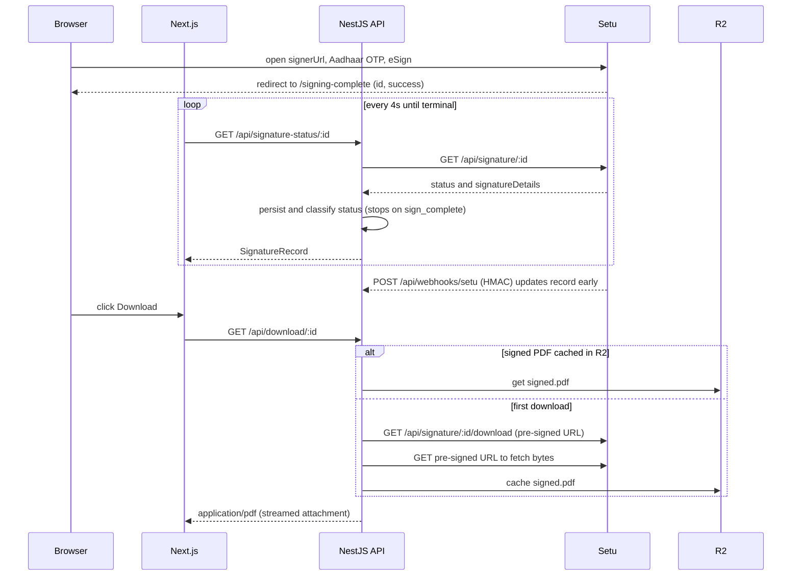

# Design document — Mango eSign

## 1. Problem & goals

Send a contract PDF out for **Aadhaar eSign** via Setu, track the signature, and retrieve
the signed document — while keeping **all Setu communication server-side**. Secondary goals:
a clean, typed contract between frontend and backend; the ability to demo the full flow
without credentials; and a production-shaped structure (layering, tests, deployability).

## 2. System architecture

The browser only ever talks to our API. The API is the only tier that holds Setu
credentials and the only tier that reaches Setu or R2. Setu reaches back two ways: a
server-to-server **webhook** and a browser **redirect** to `NEXT_PUBLIC_SITE_URL/signing-complete`
(treated as a hint — the true status is always re-fetched).

## 3. Backend layering

```mermaid
flowchart TD
  C[EsignController<br/>HTTP + DTO validation] --> S[EsignService<br/>orchestration only]
  W[SetuWebhookController] --> S
  S --> SC[SetuClient<br/>stub &#124; live]
  S --> ST[StorageService<br/>stub &#124; R2]
  S --> R[EsignRepository<br/>sole Prisma access]
  SC -. deriveFromSetu .-> S
  S -. toSignatureRecordDto .-> C
  R --> DB[(Postgres)]
  SC --> SETU[Setu REST]
  ST --> R2[(R2)]
```

- **Controller** — HTTP concerns only: multipart handling, size cap, DTO validation.
- **Service** — orchestration; holds no Prisma or wire types, only mapper outputs.
- **SetuClient** — the only Setu talker; `setu.mapper` turns its wire shape into our fields.
- **StorageService** — the only R2 talker.
- **EsignRepository** — the only Prisma talker; `esign.mapper` turns entities into DTOs.

This makes each unit independently testable (the service tests mock all three collaborators).

## 4. Key flows

### 4.1 Upload → create signature request

### 4.2 Sign → poll → download (with webhook as push complement)

Polling and the webhook converge on the same record via the shared `classifySetuStatus`
and `deriveFromSetu`, so whichever arrives first wins and the other is idempotent.

## 5. The stub / live seam

`SETU_PROVIDER` (auto-derived from credential presence) selects behaviour inside one
`SetuClient`:

| Operation | `stub` | `live` |
| --- | --- | --- |
| uploadDocument | random `doc_…` id | `POST /api/documents` multipart |
| createSignature | `sign_initiated` + `mock-sign` URL derived from redirectUrl origin | `POST /api/signature` |
| getSignature | in-memory state machine advances `pending → in_progress → complete` | `GET /api/signature/:id` |
| getDownloadInfo / fetchDocumentBytes | generated valid PDF | pre-signed URL → bytes |
| verifyWebhookSignature | bypassed | HMAC-SHA256 + constant-time compare |

Because every layer above `SetuClient` is identical in both modes, going live is purely an
env change. `StorageService` follows the same pattern (`stub` in-memory | `r2`).

## 6. Data model

A single `signature_requests` table (documented in the [README](../README.md#database)).
Design notes: **status stored as a raw string** and classified in-app (no enum migrations);
**single-signer denormalized** with a full `raw_setu` JSON snapshot for audit and future
multi-signer needs; **app-generated prefixed ids** (`req_…`) keep our public id independent
of Setu's.

## 7. Security model

- Setu/DB/R2 secrets are backend-only; nothing sensitive is a `NEXT_PUBLIC_*`.
- Browser → our API → Setu; the signed PDF's pre-signed URL is consumed server-side and the
  bytes streamed through us, so the browser never sees Setu or S3 URLs.
- Content-based PDF validation (magic bytes), 10 MB cap, class-validator on every field,
  CORS scoped to the web origin, helmet headers.
- HMAC-verified webhooks over the raw body; upstream errors mapped to a generic 502.
- Production: managed secret store + rotation (config read at boot → rotation = restart),
  least-privilege DB creds, `raw_setu` + timestamps as an audit trail, TLS end-to-end.

## 8. Resilience & failure handling

- **Terminal short-circuit** — `refreshStatus` returns immediately for `sign_complete`
  records, avoiding needless Setu calls and any regression.
- **Best-effort storage** — a failed R2 write is logged but never fails upload or download.
- **Signed-PDF cache** — downloads survive Setu's expiring URLs after the first fetch.
- **Idempotent updates** — webhook and polling can both apply the same terminal state safely.

## 9. Trade-offs & future work

- Stub Setu state is per-process; a durable stub would persist it, but the DB already holds
  the authoritative last status.
- A reconciliation cron (poll stuck requests as a webhook backstop) and an append-only audit
  table are natural next steps — the seams and `raw_setu` snapshots already support them.
- Multi-signer support would move the denormalized signer columns into a child table; the
  `raw_setu` snapshot means this is additive, not a rewrite.
